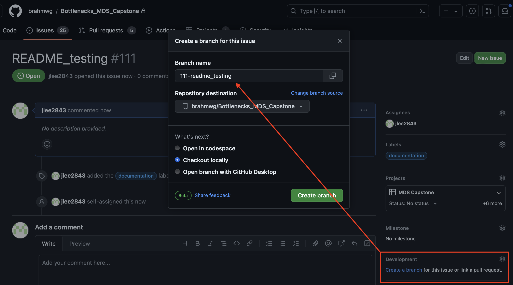

# MDS Deliverables 
During the capstone project as part of the Master of Data Science program at the University of British Columbia, our team—comprising Jenny Lee, Arturo Rey, Rafe Chang, and Riya Eliza—successfully delivered three machine learning models, one survival analysis inference model, and a set of SQL queries as requested by our partner, the Strait of Georgia. This documentation provides a concise overview of each deliverable and outlines a standardized folder structure common to all project deliverables.

## Data
Our data is sourced from the [Strait of Georgia Data Center](https://marinescience.info/superset/welcome/), which serves as a comprehensive SQL server hosting multiple tables across various schemas. The data center aggregates and manages extensive datasets relevant to marine science, encompassing diverse topics and research areas within the British Columbia region.

## List of Deliverables
| Project Title | Folder Name | Description |
| --- | --- | --- |
| Survival Analysis of Salmon in Saline Sea | `survival_analysis` | Contains an inference model to provide insights for the survival probabilities of salmon throughout their life stages. Employed the Cormack-Jolly-Seber survival modelling in combination with bayesian approach. |
| Outmigration Model | `outMigration_model` | Contains a machine learning model designed to predict the outmigration dates of salmon, categorized by species ("coho" or "chinook"). |
| Species Prediction Model (Imputation on Historical Data) | `imputation_model` | Contains a machine learning model designed to impute missing information regarding the species of salmon in historically collected data. |
| Species Prediction Model (Prediction on Cureent Data) | `species_prediction_model` | Contains a machine learning model developed to predict the species of salmon based on various input features. |
| SQL Queries | `query_catalogue` | Contains a comprehensive list of SQL queries requested by our partner. Each query is followed by detailed instructions outlining the specific information or insights the query aims to retrieve. |

## Common Folder Structure
Although our deliverables serve different purposes, we have organized the folders in a consistent structure to assist with easy navigation for users.

| Folder or File Name | Description |
| --- | --- | 
| `model` | Contains a `.pkl` or `.txt` file outlining the trained and saved model for future use. |
| `scripts` | Contains a `.py` or `.R` file with end-to-end scripts, from data preprocessing to model evaluation. |
| `demo` | Contains a Jupyter notebook (`.ipynb`) file demonstrating how to use the model. |
| `data` | Contains raw input data (`data/raw`) and preprocessed data frames from previous steps (`data/preprocessed`). |
| `plots` | Contains plots that are generated during the model training or evaluation purposes. |
| `notebooks` | Contains exploration notebooks (`.ipynb`) that document the steps leading to the current model. |
| `environment.yml` | Contains an environment file (`.yml` or `renv.lock`) that can be used to install all prerequisite libraries needed to run the model. |
| `documentation.md` | Contains a thorough documentation that recorded our thought process at deriving the model and how to interpret the results obtained from running our models. |

## Contributing
We welcome contributions to our project, whether it's proposing new features or modifying existing ones. To get involved, please refer to our [How To Contribute](CONTRIBUTING.md) documentation.

This project is open-source, meaning anyone interested in its further development is encouraged to participate.

### Submitting an Issue
If you have a proposal for a change or addition to the project, please open a [GitHub Issue](https://github.com/brahmwg/Bottlenecks_MDS_Capstone/issues) detailing your proposed implementation. Then, create a branch from the issue to begin making changes to the code.

When opening the issue, ensure to go through the appropriate labeling step to categorize and prioritize it effectively.

## License
Licenses used in this project is the **MIT License**. More detailed information can be found at [LICENSE.txt](LICENSE.txt).

### MIT License
The MIT License is a permissive free software license originating at the Massachusetts Institute of Technology (MIT). It grants users the rights to use, copy, modify, merge, publish, distribute, sublicense, and sell copies of the software. Additionally, it permits any person to whom the software is furnished to do so, subject to the following conditions:

- The above copyright notice and this permission notice shall be included in all copies or substantial portions of the software.
- The software is provided "as is", without warranty of any kind, express or implied, including but not limited to the warranties of merchantability, fitness for a particular purpose, and noninfringement. In no event shall the authors or copyright holders be liable for any claim, damages, or other liability, whether in an action of contract, tort, or otherwise, arising from, out of, or in connection with the software or the use or other dealings in the software.

### Copyright Information
- **Copyright (c) 2023 Master of Data Science at the University of British Columbia**

This license allows for broad usage and modification of the project, encouraging active collaboration and innovation while protecting the original authors from liability.