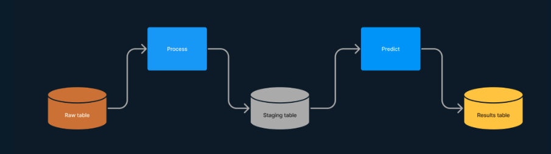

# ETL Pipeline for Strait of Georgia Model Prediction Orchestration

## 1. Goals and Objective
The primary objective of implementing a pipeline is to streamline the execution of an ETL (Extract, Transform, Load) procedure. By doing this, the pipeline automates the flow of data from extraction all the way to transformation to loading, ensuring an efficient process. The pipeline reads data from a database, processes it, and then utilizes a model to make predictions based on the processed data. After that, it dumps the prediction results into a specified table. This automation not only enhances efficiency of the process but also allows for up-to-date data processing, providing timely insights and reducing the need for manual intervention.

## 2. Methods
At the begining of the project, the option to use Apache Airflow for execution and orchestration of the pipeline was thoroughly researched. This option was tested, but resulted in being resource intensive. After further discussion with the partners, it was agreed upon to use a different method for execution and orchestration, this method being using PL/Python for execution of the scripts in-database, and cron for orchestration. 

## 3. Pipeline Structure
The pipelines consist of a processing block (Extraction + Transform) which transforms the data and dumps it into a staging table, and a predict block (Loading), which runs the models in order to get predictions, and then dumps the predictions into a results table.

The following diagram shows the general structure of the pipelines:

where:
* **Raw table:** The tables the pipelines will be reading from. These tables come from the Marine Science database.
* **Process:** The processing script where, depending on the pipeline, different transformations of the data will be performed.
* **Staging table:** The table where all the transformed data will be stored, in order to be read again by the Predict script. Having a staging table is very standard in the industry because it helps separate the extraction and transformation from the loading part of the pipeline, ensuring an easier debugging process.
* **Predict:** The script that will be performed on the transformed data. This will run the models and get a prediction which will then be stored in the Results table.
* **Results table:** Where all the results from the model prediction will be stored.

## 4. Future Recommendations
As the partners start working on more projects, it will be useful to revisit the option of using Apache Airflow for execution and orchestration of pipelines for models, and data migration and/or transformation. This is due to the fact that, PL/Python and cron implementations are not easily scalable, as the only way to do so, would be to add more scripts PL/Python and cron scripts.

The issue of scalability is easily managed by Apache Airflow, as it provides an easy to use user interface which allows the users to create more pipelines without having to rewrite PL/Python code, and it allows for jobs to be interconnected, allowing more intricate pipelines.

Apache Airflow also offers error logging, which allows users to easily pinpoint errors that may occur in pipeline execution.