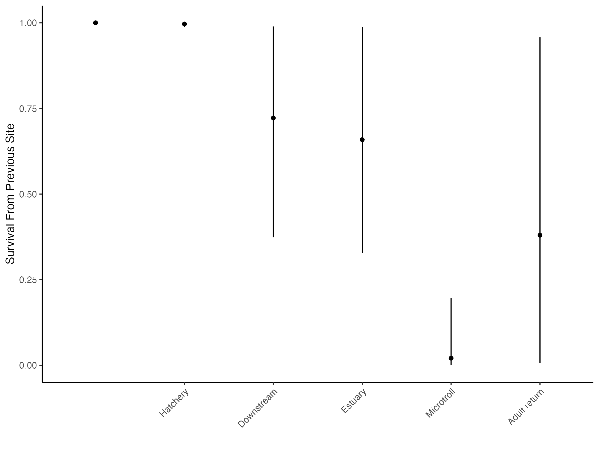
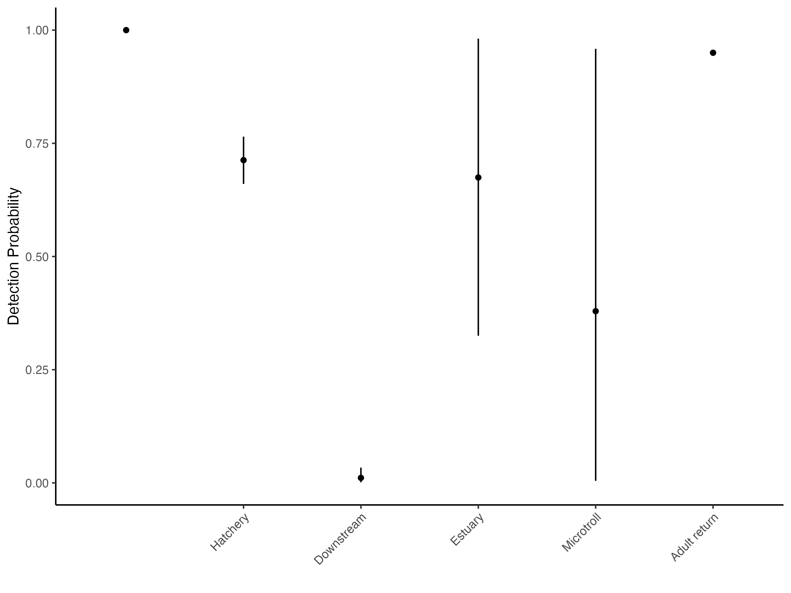

# Cormack-Jolly-Seber (CJS) Survival Analysis with Bayesian Modelling Documentation

## 1. Goals and Objective
The primary objective of the Cormack-Jolly-Seber survival analysis using a Bayesian approach is to gain insights into the survival probability, detection probability, and cumulative survival probability of salmon throughout their life cycle. This includes their outmigration to larger watersheds and oceans, as well as their return to their native habitats. This model follows the theoretical approaches outlined in the [‘Bottlenecks to Survival’ – Survival modelling update](https://github.com/brahmwg/Bottlenecks_MDS_Capstone/blob/main/documentation/Bottlenecks%20survival%20modelling_Full%20summary_May%202023_LKE%20(2).docx), authored by Dr. Laura Elmar at the Pacific Salmon Foundation.

## 2. Methods
Our study implemented the Cormack-Jolly-Seber (CJS) model (Cormack, 1964; Jolly, 1965; Seber, 1965), which was originally designed for studying bird migration. However, due to the model's heavy reliance on recapture rates, we incorporated Bayesian modeling to address concerns arising from the lack of recapture events. By utilizing prior knowledge through Bayesian modeling, we aim to enhance the analytical power of our sparse recapture data. This approach allows us to obtain more precise and accurate parameter estimates, thereby improving the reliability of our findings.

Our data is modeled using hierarchical modeling to estimate survival and detection probabilities across multiple stages of the fish's outmigration-return path. The model combines elements of the CJS model with Bayesian techniques to handle sparse recapture data effectively. This method was chosen and was originally implemented by Dr. Laura Elmar at the Pacific Salmon Foundation.

### 2.1 Prior Distribution
| Parameter | Description | 
| --- | --- | 
| $\phi_j$ | Describes the survival probability of salmon at stage $j$. |
| $p_j$ | Describes the detection probability of salmon at stage $j$. |

$$\phi_j \sim \text{Beta}(1,1)$$

$$p_j \sim \text{Beta}(1,1)$$

Both parameters are modeled using the beta distribution with fixed shape parameters of $\alpha=1$ and $\beta=1$. Hence, this corresponds to a uniform distribution over the interval [0, 1]. This means that before observing any data, every possible value of $\phi_j$ and $p_j$ is between 0 and 1 in an equally likely manner.

### 2.2 Likelihood
| Variable | Description | 
| --- | --- | 
| $z_{i,j}$ | A variable that indicates whether salmon $i$ is alive $(z_{i,j} = 0)$ or not at stage $j$. |
| $y_{i,j}$ | A variable that indicates whether salmon $i$ is detected $(y_{i,j} = 0)$ or not at stage $j$. |

$$z_{i,j} \sim \text{Bernoulli}(\phi_j, z_{i,j-1})$$

$$y_{i,j} \sim \text{Bernoulli}(p_j, z_{i,j-1})$$

These Bernoulli distributions model the probability of survival $z_{i,j}$ and detection $y_{i,j}$ at each stage $j$. $z_{i,j}$ depends on $\phi_j$, the survival probability, and possibly $z_{i, j-1}$, the survival status at the previous stage $j-1$. $y_{i,j}$ depends on $p_j$, the detection probability, and $z_{i,j-1}$, the survival status at stage $j$.

### 2.3 Cumulative Survival Probability
The cumulative survival probability $\text{Survship}_j$ can be calculated as the product of survival probabilities up to stage $j$:

$$\text{Survship}_j = \prod{k=1}^{i=1} \phi_k$$

$_j = \prod_{k=1}^{i=1} \times \phi_k$

This product represents the overall probability that a salmon survives from the initial stage up to stage $j$, considering the survival probabilities $\phi_k$ across all stages from 1 to $j$.

## 3. Results
### 3.1 Visualizations
Posterior distribution of $\phi$, $p$, and $\text{Survship}$ can are depicted with 95% credible intervals. 

 Figure 1. Posterior Distributions of $\phi$ and $p$ with 95% Credible Interval

 Figure 2. Posterior Distributions of $p$ and $p$ with 95% Credible Interval

Figure 3. Posterior Distributions of $\text{Survship}$ and $p$ with 95% Credible Interval

Plots shown above are stored uner `plots` sub-folder.

### 3.2 Conclusion

## 4. Future Recommendations
We worked towards incorporating the origin of the salmon (e.g., hatchery versus wild) as a covariate in our models. This addition will help us understand the differential survival probabilities between hatchery-reared and wild salmon. By examining the impact of origin, we can gain insights into the factors that contribute to the survival disparities and inform targeted conservation efforts.

Mathematically, this can be represented by introducing an additional covariate $\text{origin}_i$ for each salmon $i$.  The model for survival probability $\phi_{i,j}$ at stage $j$ can be modified as:
$$\log({\frac{\phi_{i,j}}{1-\phi_{i,j}}}) = \beta_0 + \beta_1 \cdot \text{origin}_i$$

where $\beta_0$ is the intercept, and $\beta_1$ is the coefficient for the origin covariate.