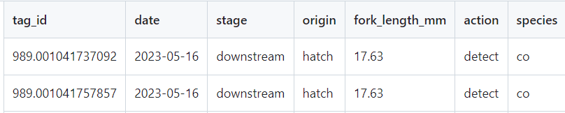

```{r setup, include=FALSE}
knitr::opts_chunk$set(echo = TRUE)
```


# Survival Analysis of Salmon in Saline Sea
> Jenny Lee, Arturo Rey, Rafe Chang, Riya Eliza

## Contents
1. [Executive Summary](#executive_summary)
2. [Introduction](#introduction)
<br> 2.1. [Motivation](#motivation)
3. [Data Products](#data_product)
<br> 3.1. [Survival Analysis](#survival_analysis)
<br> 3.2. [Outmigration Model](#further-analysis)
<br> 3.3. [Species Classification Model](#further-analysis)
<br> 3.4. [PL/Python Pipeline](#further-analysis)
4. [Conclusion and Recommendation](#further-analysis)
5. References

<a id='executive_summary'></a>
## 1.0 Executive Summary

Our collaboration with the Pacific Salmon Foundation on the Bottleneck project will yield comprehensive visual analysis tools and advanced statistical and machine learning models, directly enhancing biologists' ability to understand salmon survival trends. By leveraging techniques from the Master of Data Science program, we aim to gain deepeer understanding of salmon survival probability, considering factors like predation, body size, origin site, and others.

<a id='introduction'></a>
## 2.0 Introduction

Salmons are critical to the ecosystem as they are food to 137 species (Rahr, 2023), such as grizzly bears. In British Columbia, there are over 9,000 distinct salmon populations ("State of Salmon", 2022). However, due to climate change and industrial development in the past 150 years, the population of Pacific salmon in BC has declined and their habitats have been facing unprecedented pressures.

Pacific Salmon Foundation is a non-profit organization committed to guiding the sustainable future of Pacific salmon and its habitat. The organization has a wide range of work such as community investments and salmon health. As a part of the organization’s effort towards marine sciences, the Bottlenecks to Survival Projects investigate the survival bottlenecks, which refers to when a population size is reduced for at least one ("Understanding Evolution"), for salmon and steelhead throughout the Salish Sea and southern BC regions.

<a id='motivation'></a>
### 2.1 Motivation

In ecological terms, a bottleneck refers to a specific event that results in a sharp decline in a population over a period of time (Pacific Salmon Foundation, 2021). Identifying these bottleneck points throughout the various stages of a salmon’s life cycle is crucial, as it provides valuable insights into potential interventions to improve survival rates. Our study aims to provide comprehensive insights into the survival rates of salmon by observing the survival and detection probabilities across five critical stages of the salmon’s outmigration-return path. This includes calculating the cumulative survival probability from the first stage to the last. By understanding these probabilities, we can identify where the most significant population declines occur and implement targeted measures to enhance survival rates.

In addition to the survival analysis, our study focuses on streamlining data processes to facilitate more accurate data retrieval and analysis. This includes developing machine learning models to predict the outmigration dates of salmon, which helps in planning and resource allocation. Accurate predictions can prevent financial losses by optimizing the timing of interventions and reducing the uncertainty associated with migration patterns. Furthermore, by improving the accuracy of data retrieval, we ensure that our findings are based on reliable and timely information, enhancing the overall effectiveness of conservation efforts.

In summary, our study not only aims to identify and address the critical bottlenecks in the salmon life cycle but also enhances the data processes to support more efficient and effective management practices. By combining survival analysis with advanced data modeling techniques, we provide a robust framework for improving the survival rates of salmon and ensuring the sustainability of their populations.

## 3.0 Data Products
<a id='survival_analysis'></a>
### 3.1 Survival Analysis
In this study, we employ the survival analysis model of salmon augmented with Bayesian modeling, to estimate the survival and detection probabilities of salmon across five stages of their outmigration-return path. This approach enables us to derive precise and accurate parameter estimates, helping to identify critical bottlenecks in the salmon life cycle and providing valuable insights for potential interventions to improve survival rates.

#### 3.1.1 Preprocessing

The data was extracted using SQL queries, stage-wise from the Strait of Georgia data center. The 5 stages identified were facility (hatchery), downstream, estuary, field (or microtroll) and return. For each of these stages, we wanted data of all wild and hatchery origin fishes. SQL queries were used to extract the required data from the data center. The columns extracted were the unique tag_id of a fish, the date on which it was detected, the “stage” at which this data is derived from, the origin of the fish (hatchery/ wild), the fork length of the fish, action (tag/ detect), species of the detected fish.

 
After data from all 5 stages are extracted in this manner, the datasets then go into a preprocessing.R file to be combined together. At this stage, we make any nomenclature changes needed to mitigate the variations in data that may have happened during the collection process. Finally, we output a CSV file (survival_analysis.csv) containing the data of all detections from all 5 stages.

#### 3.1.2 Data Science Method

Our study implemented the Cormack-Jolly-Seber (CJS) model (Cormack, 1964; Jolly, 1965; Seber, 1965), which was originally designed for studying bird migration. However, due to the model's heavy reliance on recapture rates, we incorporated Bayesian modeling to address concerns arising from the lack of recapture events. By utilizing prior knowledge through Bayesian modeling, we aim to enhance the analytical power of our sparse recapture data. 

The Bayesian approach improves the precision and accuracy of our parameter estimates by integrating prior knowledge, which stabilizes estimates when data is sparse. It acts as regularization to prevent overfitting, facilitates hierarchical modeling to borrow strength across different levels, and naturally quantifies uncertainty through credible intervals. This flexibility allows for complex model specifications that better capture the underlying biological processes, enhancing the reliability of our survival and detection probability estimates despite the limitations of sparse recapture data.

Our data is modeled using hierarchical modeling to estimate survival and detection probabilities across multiple stages of the fish's outmigration-return path. The model combines elements of the CJS model with Bayesian techniques to handle sparse recapture data effectively.

Our prior distributions are as follows, where $j$ indicates probabilities between stages. $\phi_j$ depicts the survival probability of salmon across different stages, and $p_j$ depicts the detection probability of salmon across different stages. 

$$\phi_j \sim \text{Beta}(1,1)$$
$$p_j \sim \text{Beta}(1,1)$$

Our likelihood distributions are as follows, where $i$ indicates individual salmon. $z_{i,j}$ returns a binary value of either $0$ or $1$ to depict survival status of the fish, and $y_{i,j}$ depicts the binary value of either $0$ or $1$ to depict tagging status of the fish. A value of $0$ indicates a negative status for the salmon, meaning it has either not survived at the stage or has not been detected. Conversely, a value of $1$ indicates a positive status, meaning the salmon has survived the stage or has been detected.

$$z_{i,j} \sim \text{Bernoulli}(\phi_j, z_{i,j-1})$$
$$y_{i,j} \sim \text{Bernoulli}(p_j, z_{i,j-1})$$

Lastly, to capture the cumulative survival rates of salmon across all stages, we recursively compute the cumulative probability through each stage based on the survival probability of the past stage. Note that $k$ represents a stage before the current stage $j$.  The cumulative survival probability, $\text{Survship}_j$ is calculated by taking the product of survival probabilities across all stages up to $j$. This approach provides an overall measure of the survival likelihood of salmon through multiple stages of their life cycle, from their origin to their return.
$$\text{Survship}_j = \prod_{k=1}^{j} \phi_k$$

This cumulative measure is crucial for understanding the overall survival dynamics of the salmon population, as it aggregates the individual stage-wise survival probabilities into a single metric that reflects the compounded likelihood of survival across the entire migratory journey.

#### 3.1.3 Conclusion and Future Recommendations

We worked towards incorporating the origin of the salmon (e.g., hatchery versus wild) as a covariate in our models. This addition will help us understand the differential survival probabilities between hatchery-reared and wild salmon. By examining the impact of origin, we can gain insights into the factors that contribute to the survival disparities and inform targeted conservation efforts.

Mathematically, this can be represented by introducing an additional covariate $\text{origin}_i$ for each salmon $i$. The model for survival probability $\phi_{i,j}$ at stage $j$ can be modified as:
$$\log({\frac{\phi_{i,j}}{1-\phi_{i,j}}}) = \beta_0 + \beta_1 \cdot \text{origin}_i$$

where $\beta_0$ is the intercept, and $\beta_1$ is the coefficient for the origin covariate.