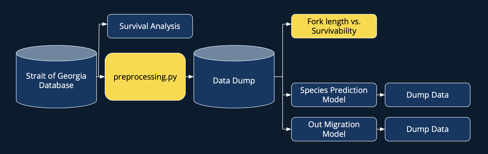

# Proposal Report
Title: Survival analysis of salmon in the Salish sea  
Team members: Jenny, Arturo, Rafe, Riya

## Executive summary
Our collaboration with the Pacific Salmon Foundation on the Bottleneck project will yield comprehensive visual analysis tools and advanced statistical and machine learning models, directly enhancing biologists' ability to understand salmon survival trends. Leveraging techniques from the Master of Data Science program, we aim to deliver impactful solutions for informed ecological study.

## Introduction
Salmons are critical to the ecosystem as they are food to [137 species](https://wildsalmoncenter.org/why-protect-salmon/), such as grizzly bears. In British Columbia, [there are over 9,000 distinct salmon populations](https://psf.ca/salmon/). But due to climate change and industrial development in the past 150 years, the population of Pacific salmon in BC had declined and their habitats had been facing unprecedented pressures. 

Pacific Salmon Foundation is a NGO, the organization’s mission is to guide the sustainable future of Pacific salmon and its habitat. The organization had a wide range of work such as community investments and salmon health. As a part of the organization’s effort towards marine sciences, the Bottlenecks to Survival Projects investigate the survival bottlenecks, which refers when a [population size is reduced for at least one generation](https://evolution.berkeley.edu/bottlenecks-and-founder-effects/), for salmon and steelhead throughout the Salish sea and southern BC regions. 

The data for this project consists of tagging fishes with PIT tags at hatcheries and in the field, and the encounter of fishes and PIT antenna array or with captures.   

## Deliverables
### 1. Dashboard - Fork length v/s Survivability

### 2. Basyesian modelling
As a crucial component of our project, we will be involved in enhancing a survival analysis model utilizing Cormack-Jolly-Seber (CJS) Bayesian modeling techniques. This model is widely used in ecological research, for predicting changes in animal populations. Utilizing data gathered since 2021, the Pacific Salmon Foundation collected information pertaining to the posterior parameters of the Bayesian model. To establish robust prior distributions, telemetry data from previous researches are used.

### 3. Species prediction model
The goal of this model is to help fill information that was missed out during manual data collection, i.e; an imputation model.This model will be a supervised machine learning model using a decision tree. The labels for this model would be the different kinds of fishes found in the salish sea. Another output of this model is the confidence percentage for each of the predictions. This will help scientists decide whether they want to accept or reject the prediction. An interactive dash app will be created to take user inputs and view results of the prediction.

### 4. Outmigration model
This model is aiming to predict the freshwater outmigration timing for Coho and Chinook salmons. We will use the data of tagging data, detection data, and site temperature data to predict salmon outmigration. We are planning to use time series in modeling. 

## Pipeline
To ensure the continual updating of dashboards and models, it is important to establish a systematic workflow orchestration mechanism that executes at predefined schedules. This basically means the creation of a pipeline, which serves as the central concept for managing these processes. While numerous tools are available for this purpose, our partner has specifically requested the utilization of Apache Airflow. Apache Airflow is an open-source tool to programmatically author, schedule, and monitor workflows. It leverages directed acyclic graph (DAG) representation to facilitate user interaction and visually depict pipeline workflows.  

The implementation of the pipeline will follow the ETL (Extract, Transform, Load) principle. This involves extracting data from the Strait of Georgia Database, performing transformation operations using a Python script, and subsequently loading the processed data into cleaned tables within the same database. The models and dashboards will then retrieve information from these tables. The pipeline's operational flow is outlined in the following diagram:

## Stretch goals
As previously mentioned, our primary efforts will be directed towards refining survival analysis modeling and developing two machine learning models. With these milestones accomplished, we are shifting our attention to stretch goals—additional objectives that may extend beyond the capstone period. Our stretch goals encompass the creation of two interactive dashboards: one to visualize the prediction rate of predators by herons and sea owls, and the other to compare the initial and return body sizes of salmon returning to the hatchery.

Stretch goals are aimed at maximizing progress within the remaining time frame, without a strict commitment to completing the work by the end of the capstone period. Our objective is to deliver comprehensive documentation alongside the primary deliverables, ensuring that the work can be seamlessly transitioned to other professionals for further development after the capstone period.

## Timeline
Week 1 - Deliver SQL queries  
Week 2 - Understand Survival analysis paper and re-defining requirements, work on species prediction and outmigration models  
Week 3 - Start working on survival analysis model, distribute the work, assign each section of the modelling to a team member  
Week 4 - Rest will be done when we meet with stakeholders  
Week 5 - 
Week 6 - 
Week 7 - 

